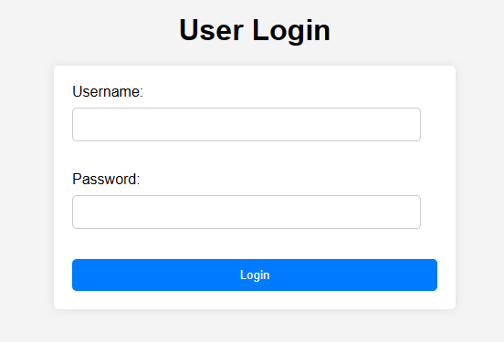

# SQLI-demo
[SQLI_Report.pdf](https://github.com/ralphg1002/SQLI-demo/files/14965140/ECE_1155_Term_Report.pdf)

### 1. Clone the repository:
```
git clone https://github.com/ralphg1002/SQLI-demo.git
```
### 2. Terraform setup:
- Create a new terraform workspace
- Set your own database and security group configuration in the provided terraform file
- Upon planning and applying the terraform confirguation

### 3. DB configuration:
- First, copy the RDS database endpoint from the console
- Modify connection.php with your database configurations
- Connect to the database using the configurations and run commands in sql file

>You can verify the tables are added to the db by running the select commands at the bottom of the sql file

### 4. Instance configuration
- SSH into ec2 instance using terminal or console
- Run the following commands **in order**:
```
sudo apt-get update
sudo add-apt-repository ppa:ondrej/php
sudo apt-get install apache2 php8.1 php8.1-mysql php8.1-mbstring php8.1-xml php8.1-curl -y
sudo systemctl restart apache2
sudo systemctl enable apache2
```

To verify that php is installed correctly:
```
php -v
```

To verify apache2 is running:
```
service apache2 status
```

**Now we are going to add all the files for the app. Lets navigate to the html directory:**
```
sudo su
cd /var/www/html/
```

First remove the current index.html file by running:
```
rm index.html
```

Add the files adn their contents located in the php_app to the current directory:
```
nano {filename}
```
---
## Finally, connect to the login page using the public ipv4 address
(If the request takes too long on chrome try another browser)


